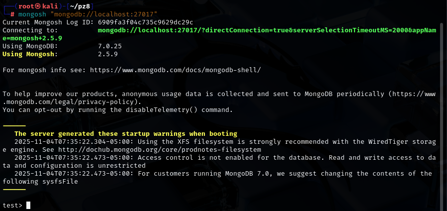
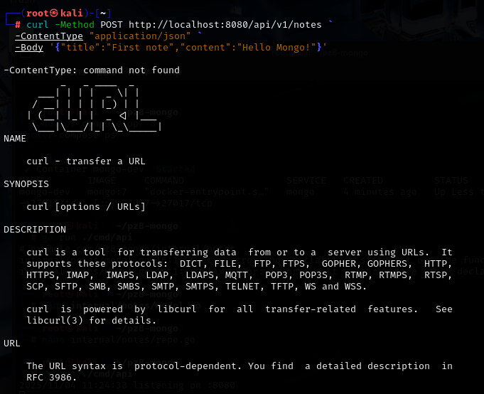
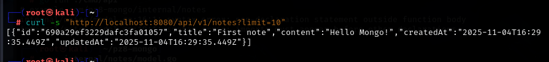
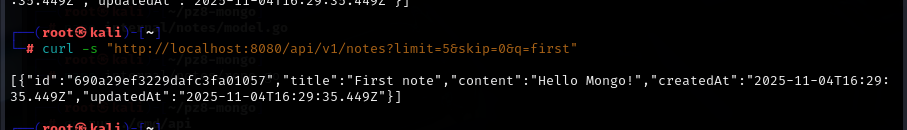
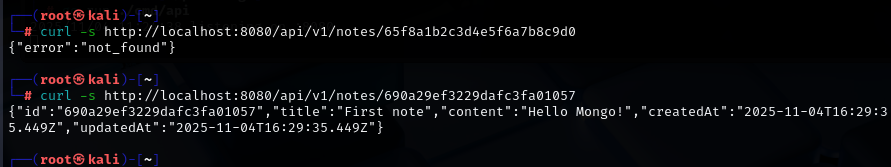
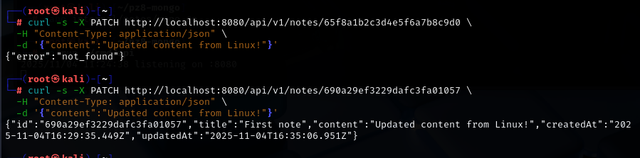
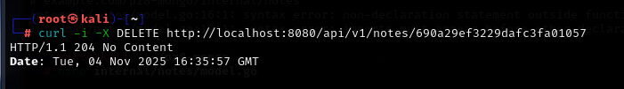

# практическа работа 8
## ЭФМО-02-25 Фомичев Александр Сергеевич
### Структура проекта:
```
services:
  mongo:
    image: mongo:7
    container_name: mongo-dev
    ports:
      - "27017:27017"
    environment:
      MONGO_INITDB_ROOT_USERNAME: root
      MONGO_INITDB_ROOT_PASSWORD: secret
    volumes:
      - mongo_data:/data/db
volumes:
  mongo_data:

```
## Цели занятия
-	Понять базовые принципы документной БД MongoDB (документ, коллекция, BSON, _id:ObjectID).
-	Научиться подключаться к MongoDB из Go с использованием официального драйвера.
-	Создать коллекцию, индексы и реализовать CRUD для одной сущности (например, notes).
-	Отработать фильтрацию, пагинацию, обновления (в т.ч. частичные), удаление и обработку ошибок.

## 1) Запуск mango


## 2) проверка через curl 
## Создать


## проверка что создалось 


## Список


## Получить по id


## Частичное обновление


## Удаление


